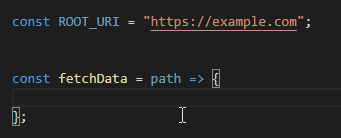

# JavaScript Auto Backticks

This extension will automatically convert single or double quotes to backticks when needed.

Just start typing a regular string, the extension will transform it into a template literal as soon as it detects placeholders (`${}`).

Works with `.js`, `.vue` and `.ts` files.
